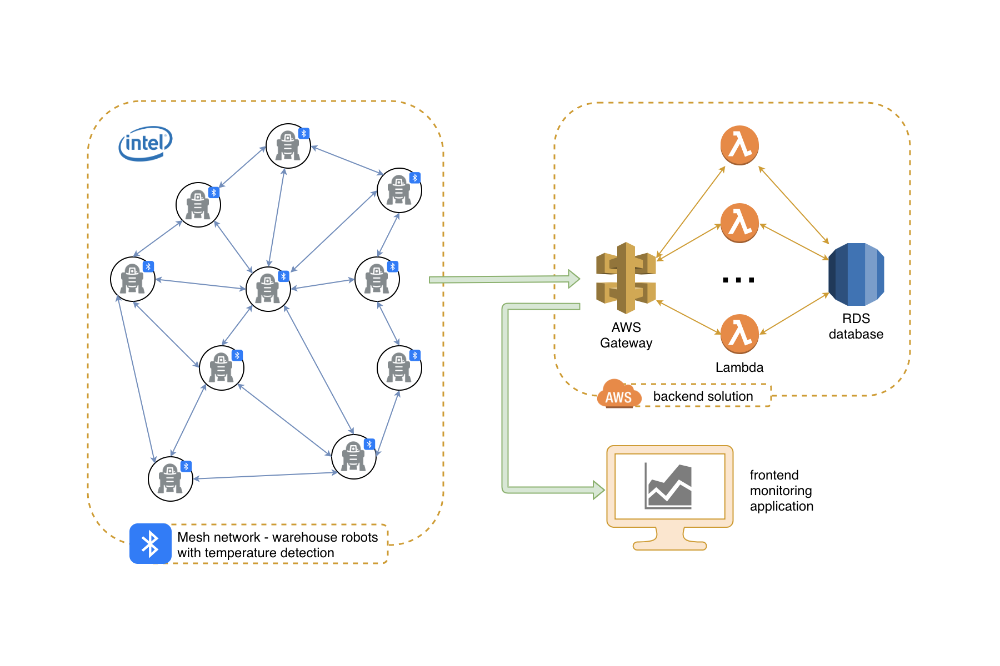

# Super Awesome Unicorn Bluetooth Mesh Lego Robot Device

## Inspiration
In large warehouses humans have long been replaced by robots that take over dangerous and/or repetitive tasks ensuring a less error-prone and automated execution. But as humans do, these robots have to work together as a team, sometimes synchronized in working on the same tasks, sometimes notifying each other about environmental changes. To ensure a stable and reliable form of communication, they should use their own network, decoupled from all other processes and lines of communication within the warehouse. We see Bluetooth Mesh as the perfect techonology to use in such environments. 

## What our project does
We built a prototype of such a robot team, a robot swarm. They are connected in a Bluetooth Mesh network, all carrying their own device equipped with temperature sensors. 

The setting is a warehouse that stores frozen food. For safety reasons the chain of cooling cannot be interrupted or else food will go bad and/or endanger people's health.

One of our robots is making his rounds through the warehouse. At one place he detects a rise in temperature. That change will make him back off and notify two other robots who will receive that message, represented by blinking of LEDs. In a real life scenario, they would react and could, for example, intervene to reduce the temperature to the original value or call other robots for help.

## How we built it
We started by getting familiar with Bluetooth Mesh and the devices. While one of use worked on building the robots, two worked on building the communication network and one on the backend solution and monitoring application.

We built scalable backend solution with newest Amazon technologies, such as: Lambda, AWS Gateway and RDS. Data from backend is consumed via iPad application that monitors tempretature sensors. We also wrote code that allowed monitoring of reel boards and communication between them. 

## Accomplishments that we are proud of
We are proud that in such a short period of time we got familiar with a completely new technology and used it in a fun and interesting way while at the same time delivering a solution for a real world problem.

## Built with

* 4 Bluetooth Mesh devices
* 3 LEGO boost robots
* Web application (Lambda, AWS Gateway, RDS, CloudWatch)
* Mobile application (iOS Swift)
* NodeJS and Phython scripts for reel board
* A lot of enthusiasm and love

## Members

* Christin Loehr
* Gabriela Tripon
* Goran Vuksic
* Dennis Micky Jensen